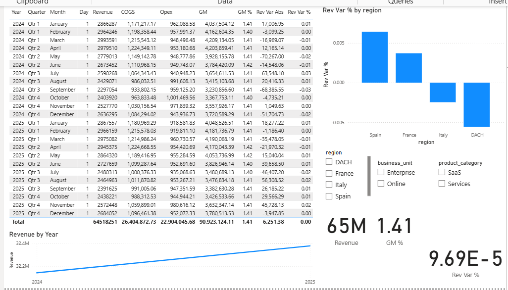
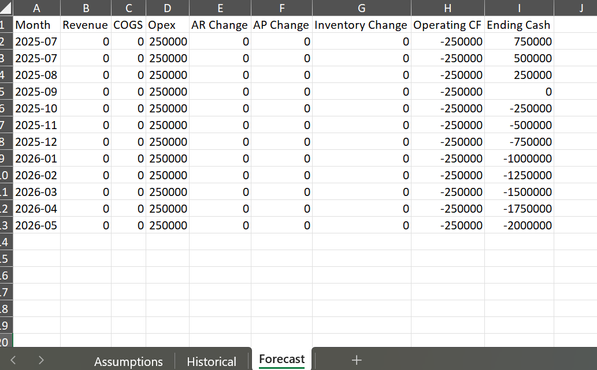

# Finance & Data Analytics Portfolio
I am a results-driven finance and data analytics professional with a strong foundation in FP&A, controlling and business analysis. My expertise is in building practical, data-driven solutions such as interactive dashboards, driver-based models and SQL powered reports that help businesses monitor performance, forecast outcomes and make informed decisions. With a Master’s in International Business and hands-on experience across multiple tools and data environments, I focus on turning complex data into clear and actionable insights that support strategic growth.

Hi, I’m Ansar Mukhtar, a Finance and data analytics professional with a Master’s in International Business and practical experience in FP&A, controlling, and business analysis.  

I create financial models, dashboards, and analytical tools that turn raw numbers into clear, actionable insights.  
This portfolio presents a selection of my work, covering budgeting and forecasting, Excel-based modeling, and SQL-driven financial reporting.

---

## 📂 Projects

### 1. Budget vs Actuals Dashboard  
**Tools:** Power BI, DAX, Excel, SQL  

This interactive dashboard tracks revenue, costs, and variances by region, business unit, and product category.  
It includes month-over-month trends, variance analysis in both absolute and percentage terms, and gross margin KPIs.  
Users can filter results using dynamic slicers for time periods, regions, and product categories.

  

---

### 2. Driver-Based Cash-Flow Model  
**Tools:** Excel (Formulas, Scenario Analysis)  

A 12-month cash-flow forecast that uses growth rates, COGS percentages, and working-capital assumptions such as DSO, DPO, and inventory days.  
It features a scenario sheet that allows changes in sales growth or payment terms to be tested easily, with automatic updates to forecast results.  
The model outputs the monthly net cash position and ending balance.

  

[Download Model](Projects/cashflow_excel/driver_based_cashflow_model.xlsx)

---

### 3. SQL Finance Mart  
**Tools:** SQLite, SQL, Data Modeling  

A small but complete database designed for finance analytics, containing tables for orders, customers, products, and general ledger transactions.  
The project demonstrates producing P&L by month, identifying top customers, and calculating revenue by region, with queries and results that can feed directly into BI tools.

[View Queries](Projects/sql_finance_mart)

---

## 📬 Contact
**Email:** ansarsandhu74@gmail.com  
**LinkedIn:** https://www.linkedin.com/in/ansarmukhtar/  
**GitHub:** https://github.com/ansarmukhtar/Portfolio  

---

*All datasets are anonymised or synthetic and used for demonstration purposes only.*
